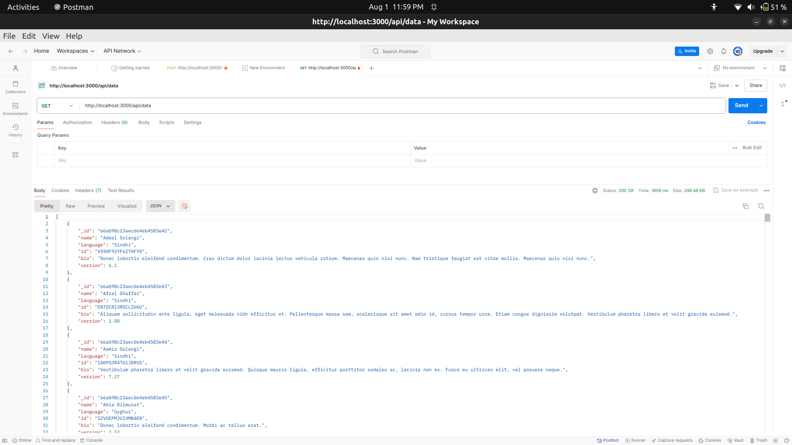
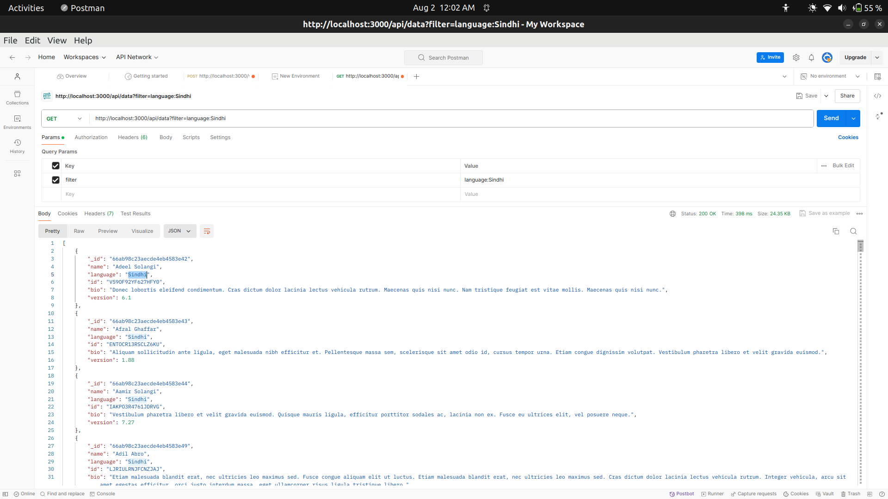
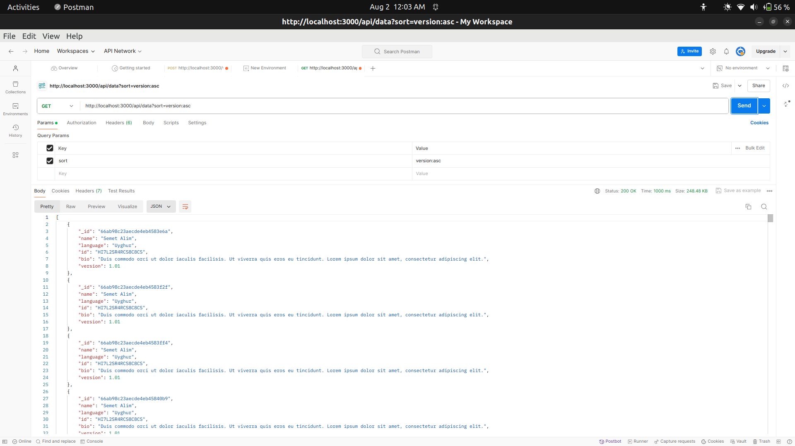
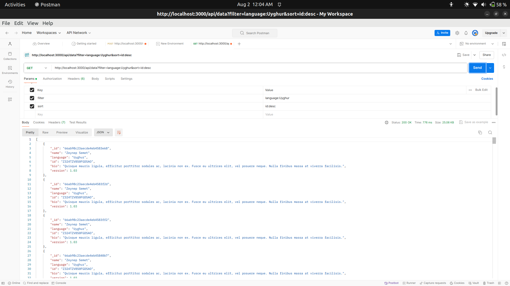
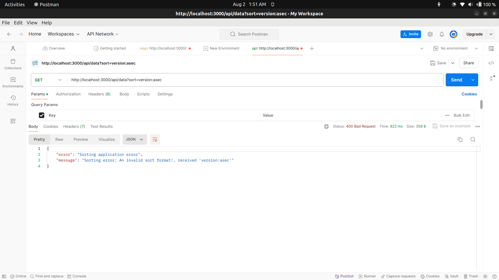
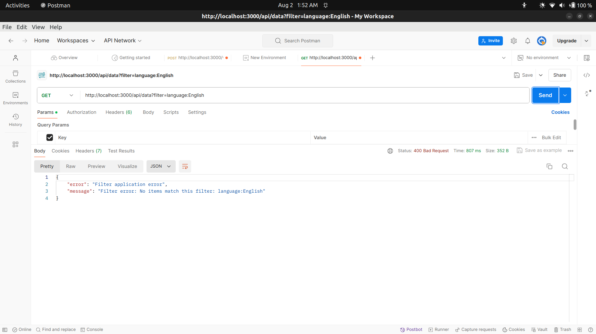
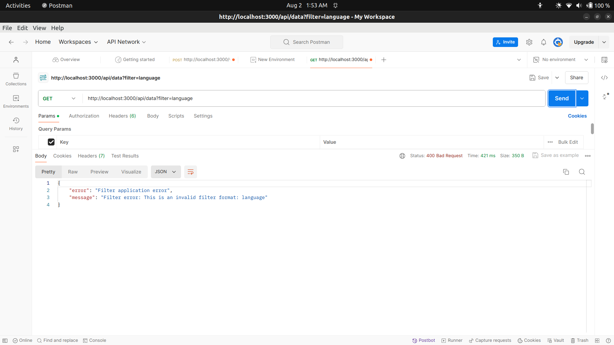

# nodejs-dummy-data-project with MongoDB
This project demonstrates how to set up a Node.js server that retrieves dummy JSON data, stores it in MongoDB, and provides an API for accessing, filtering, and sorting the data.
- Data is managed in MongoDB for efficient querying.
- Filtering and sorting are handled directly by the database.

# This project covers:

- Fetching external data and persisting it in MongoDB
- Creating a RESTful API using Express
- Implementing data filtering and sorting features
- Handling errors and validating inputs

# To run this project, you'll need:

- Node.js (version 12.0.0 or above)
- npm (version 6.0.0 or above)
- MongoDB (version 4.0 or above)

# Instructions to Setup
Clone the repository:
```bash
   git https://github.com/jiya-singhal/nodejs-dummy-data-project.git
   cd nodejs-dummy-data-project
```
Create a `.env` file:
In the root directory, create a .env file and add the following environment variables:
- DATA_URL=<insert_data_source_url_here>
- PORT=3000
- MONGO_URI=<your_mongodb_connection_string>

# Install dependencies:

Run the following command to install the necessary packages:

1. dotenv - For managing environment variables:
```bash
npm install dotenv
``` 
2. axios - For making HTTP requests:
```bash
npm install axios
``` 
3. mongodb - For interacting with MongoDB:
```bash
npm install mongodb
``` 
# Initialize the database:
Run the script to fetch and store the initial data in MongoDB:

```bash
node initialize.js
``` 
# Start the server:
```bash
node server.js
```
The server will be available at http://localhost:3000

## Structure of Project

- app.js: Initializes the Express application.
- initialize.js: Fetches and inserts initial data into the database.
- routes/dataRoute.js: Defines the API endpoints.
- controllers/dataController.js: Contains the business logic for data handling.
- services/dataService.js: Manages database interactions.
- utils/dataUtils.js: Utility functions for processing data.


# Initial Data Setup
Before running the server, initialize the database : `node initialize.js`

# API Endpoints

 *Get All Data:*
``` http://localhost:3000/api/data ``` 

 *Filter Data: *
Format: key:value,key2:value2
``` http://localhost:3000/api/data?filter=key:value ```
Filtering is case-insensitive and supports partial matches

 *Sort Data:*
Format: field:order
``` http://localhost:3000/api/data?sort=field:order ```
 Ascending-  'asc'
 Descending- 'desc' 

 *Filter and Sort Data:*
``` http://localhost:3000/api/data?filter=key:value&sort=field:order ```


# Error Handling
The API handles errors for various scenarios:

- 1. Invalid Filter Format

* URL: `http://localhost:3000/api/data?filter=language`
* Response:
```json

{
    "error": "Filter error",
    "message": "Filter error: Invalid filter format: language"
}
```
- 2. Unknown Query Parameters

* URL: `http://localhost:3000/api/data?sorted`
* Response:
```json

{
    "error": "Invalid query parameter",
    "message": "The following query parameter(s) are not recognized: sorted"
}
```

- 3. Incorrect Sort Format

* URL: `http://localhost:3000/api/data?sort=version:decs`
* Response:
```json

{
    "error": "Sorting error",
    "message": "Sorting error: An invalid sort format!, received 'version:decs'"
}
```


- 4. No Data Matching the Filter

* URL: `http://localhost:3000/api/data?filter=language=hinfi`
* Response:
```json

{
    "error": "Filter error",
    "message": "Filter error: No items match this filter: language=hinfi"
}
```


# Postman Collection
 
 ### Testing the API with Postman

- Launch Postman and create a new request.
- Set the request type to GET.
- Enter the appropriate URL (e.g., http://localhost:3000/api/data).
- Add query parameters as needed (e.g., filter, sort).
- Click Send to execute the request and view the response.

### Retrieve All Data


- *url* : `http://localhost:3000/api/data`
*Description*: Fetches all records from the database.

   * *output*

### Filter data according to the format requested
- *url* :  `http://localhost:3000/api/data?filter=language:Sindhi` 
*Description*: Retrieves records where the language is Sindhi.
   * *output*

### Sort data according to the format requested
*Description*: Sorts the records by the version in ascending order.
- *url* : `http://localhost:3000/api/data?sort=version:asc`
  
    * *output* 

### Filter and sort
*Description:* Retrieves records where the language is Uyghur and sorts them by ID in descending order.

- *url* : `http://localhost:3000/api/data?filter=language:Uyghur&sort=id:desc`

    * *output* 


## Errors

- *Unknown query parameters*
  - *URL*: `http://localhost:3000/api/data?unknownParam=test`
  - *Response*: 

- *Invalid sort format*
  - *URL*: `http://localhost:3000/api/data?sort=version:decs`
  - *Response*: 

- *No matching items*
  - *URL*: `http://localhost:3000/api/data?filter=language=English`
  - *Response*: 

- *Invalid filter format*
  - *URL*: `http://localhost:3000/api/data?filter=language`
  - *Response*: 
